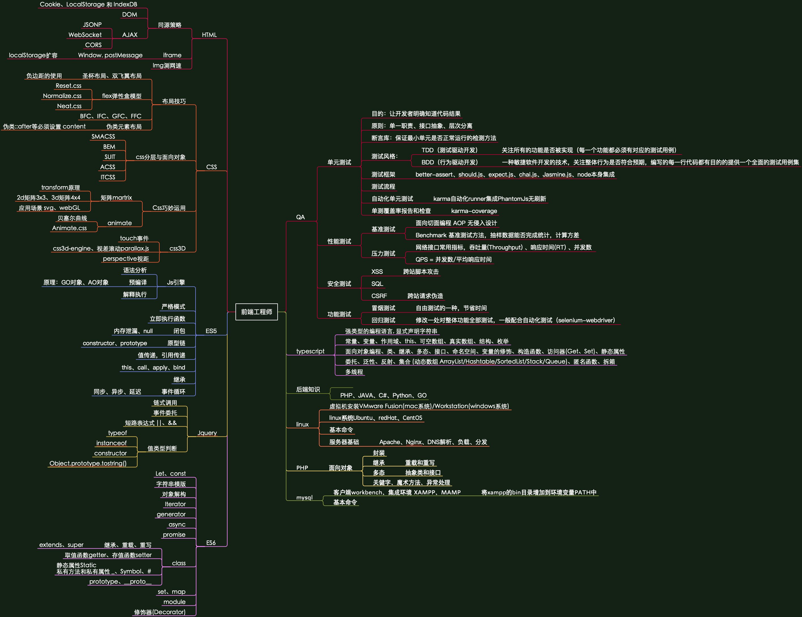

# 笔记和思维导图

#### 持续更新中...

| Author 	| britz            	|
|--------	|------------------	|
| E-mail 	| 906443185@qq.com 	|

[你不知道的HTML（跨域）](./note/你不知道的HTML.md)（录播）

[CSS高级技巧](./note/CSS高级技巧.md)（录播）

[JavaScript与QA工程师](./note/JavaScript和QA工程师.md)（录播）

[TypeScript的前世今生](./note/TypeScript的前世今生.md)（录播）

[EcmaScript5核心技术](./note/EcmaScript5核心技术.md)（直播）

[你不知道的CSS](./note/你不知道的CSS.md)（直播）

[教你打造一款逆天的item2](./note/教你打造一款逆天的item2.md)（PDF）

[JavaScript与QA工程师2](./note/JavaScript和QA工程师2.md)（直播）

[Linux基本命令](./note/Linux基本命令.md)

[Php必备基础知识](./note/Php必备基础知识.md)

[JavaScript函数式编程](./note/JavaScript函数式编程.md)（直播）

[node.js录播课](./note/node.js录播课.md)（录播）

[express.js录播课](./note/express.js录播课.md)（录播）

[koa.js录播课](./note/koa.js录播课.md)（录播）
