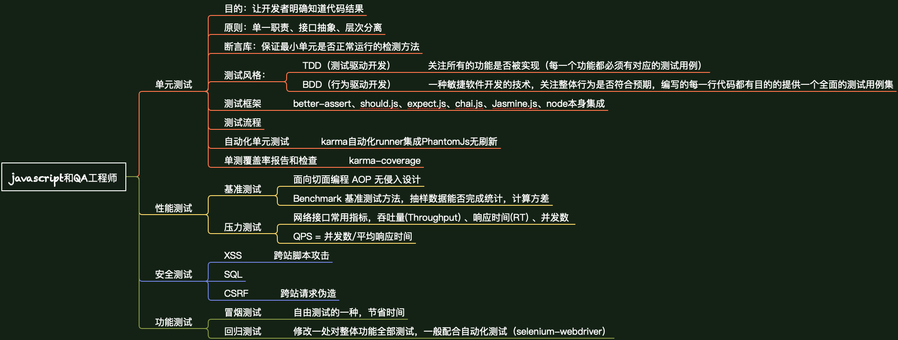

#### JavaScript和QA工程师
------------------------



##### 单元测试

+ 目的：让开发者明确知道代码结果
+ 原则：单一职责、接口抽象、层次分离
+ 断言库：保证最小单元是否正常运行的检测方法
+ 测试风格：
	- 测试驱动开发（ TDD ）：关注所有的功能是否被实现（每一个功能都必须有对应的测试用例）
	- 行为驱动开发（ BDD ）：关注整体行为是否符合整体预期，编写的每一行代码都有目的提供一个全面的测
+ 单元测试框架 
	- better-assert（ TDD 断言库 ）
	- should.js（ BDD 断言库 ）
	- expect.js（ BDD 断言库 ）
	- chai.js（ TDD、BDD 双模 ）
	- Jasmine.js（ BDD ）
	- node本身集成
+ 单元测试流程（ 每一个测试用例通过describe进行设置 ）
	- before 单个测试用例 it 开始之前
	- beforeEach 每一个测试用例开始前
	- it 利用测试用例并利用断言库进行设置 chai 如：exprct(x).to.equal(true);
	- after
	- afterEach
+ 自动化单元测试
	- karma自动化runner集成PhantomJs无刷新
	
	```javascript

		npm install -g karma
		
		npm install karma-cli --save-dev
		
		npm install karma-chrome-launcher --save-dev
		
		npm install karma-phantom.js-launcher --save-dev
		
		npm install karma-mocha --save-dev
		
		npm install karma-chai --save-dev
		
	```
+ 报告和单测覆盖率检查

	```javascript

		npm install karma-coverage --save-dev
		
		coverageReporter:{
			type: 'html',
			dir: 'coberage/'
		} 
		// 配置代码覆盖率测试率生成结果
		
	```


##### 性能测试

+ 基准测试
	- 面向切面编程 AOP 无侵入式统计
	- Benchmark 基准测试方法，抽样数据能否完成统计，计算方差
+ 压力测试
	- 对网络接口做压力测试需要检测的几个常用指标：响应时间(RT)、吞吐量(Throughput)、并发用户数、QPS每秒查询率(Query Per Second) 反映了服务器并发处理能力。
	- QPS（Query Per Second 每秒查询数）、TPS（transactions per second 每秒事务数）、HPS（每秒HTTP请求数）
	- QPS（TPS）= 并发数/平均响应时间
	- 响应时间：系统对请求作出响应的时间。
	- 吞吐量：系统在单位时间内处理请求的数量
	- 并发数：系统可以同时承载的正常使用系统功能的用户的数量
	- 常用的压力测试工具：ab、siege、http_load 

##### 安全测试

+ 安全漏洞检查
	- XSS：跨站脚本攻击
	- SQL
	- CSRF：跨站请求伪造

##### 功能测试

+ 用户真实性检查
	- selenium-webdriver 自动化测试
	- protractor selenium-standalone（ Angular ）
	- http:// webdriver.io/
	- 冒烟测试（SmokeTest自由测试的一种）找到一个bug开发修复，然后专门针对此bug。  
		优点：节省时间  
		缺点：覆盖率极低
	- 回归测试：修改一处对整体功能全部测试，一般配合自动化测试（selenium-webdriver）

##### JS Lint & JS Hint
- 目的：检测JS代码标准
- 原因：JS代码诡异，保证团队代码规范
- 搭配自动化任务管理工具完善自动化测试
