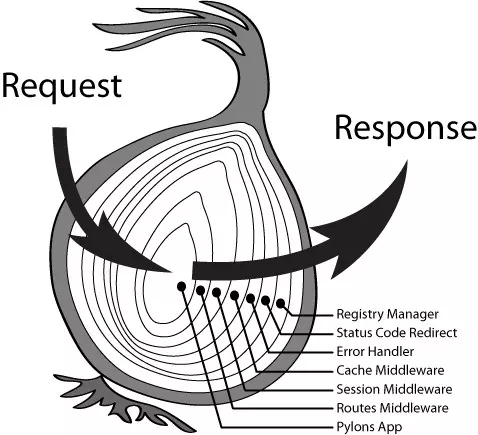

## Koa 入门

[Koa](https://koajs.docschina.org/) 新一代的 node.js web 开发框架

通过利用 async 函数，Koa 帮你丢弃回调函数，并有力地增强错误处理。 Koa 并没有捆绑任何中间件， 而是提供了一套优雅的方法，帮助您快速而愉快地编写服务端应用程序。

关键的设计点是在其低级中间件层中提供高级“语法糖”。包括诸如内容协商，缓存清理，代理支持和重定向等常见任务的方法。尽管提供了相当多的有用的方法 Koa 仍保持了一个很小的体积，因为没有捆绑中间件。

#### 级联



[中间件级联原理](https://www.jianshu.com/p/02ed208d4577)


- 中间件执行就像洋葱一样，最早 use 的中间件，就放在最外层。处理顺序从左到右，左边接收一个 request，右边输出返回 response。
- koa 官方文档上把外层的中间件称为"上游"，内层的中间件为"下游"。
- 一般的中间件都会执行两次，调用 next 之前为第一次，调用 next 时把控制传递给下游的下一个中间件。当下游不再有中间件或者没有执行 next 函数时，就将依次恢复上游中间件的行为，让上游中间件执行 next 之后的代码。

#### 设置

- app.env 默认是 NODE_ENV 或 "development"
- app.listen(...) 创建并返回 HTTP 服务器，可以同时作为 HTTP 和 HTTPS 或多个服务器地址监听一个 koa 应用
- app.context 是从其创建 ctx 的原型，可以通过编辑 app.context 为 ctx 添加其他属性。

  ```js
  app.context.db = db();

  app.use(async ctx => {
    console.log(ctx.db);
  });

  // ctx 上的许多属性都是使用 getter ，setter 和 Object.defineProperty() 定义的。
  // 你只能通过在 app.context 上使用 Object.defineProperty() 来编辑这些属性（不推荐）
  ```

#### 错误处理

通过 try/catch 更好的处理错误。

#### 上下文 (Context)

Koa Context 将 node 的 request 和 response 对象封装到单个对象中，为编写 Web 应用程序和 API 提供了许多有用的方法。
```js
app.use(async ctx => {
  ctx; // 这是 Context，具体方法和访问器，即 this
  ctx.req; // 这是 node 的 Request
  ctx.res; // 这是 node 的 Response
  ctx.request; // 这是 koa Request
  ctx.response; // 这是 koa Response
  ctx.app; // 应用实例引用
});
```
koa1实战：
- koa-router
- [generator-koa](https://github.com/peter-vilja/generator-koa)
- request-promise

koa2实战：

- koa-simple-router
- koa-static
- koa-convert koa1转换器
- koa-swig
- [co](https://github.com/tj/co) - koa使用的控制流引擎

[Koa 中文文档](https://github.com/demopark/koa-docs-Zh-CN)

[Koa 与 Express 对比](https://github.com/demopark/koa-docs-Zh-CN/blob/master/koa-vs-express.md)

[从 Koa v1.x 迁移到 v2.x](https://github.com/demopark/koa-docs-Zh-CN/blob/master/migration.md)
