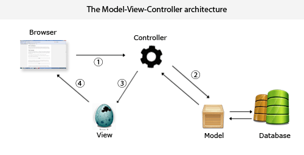
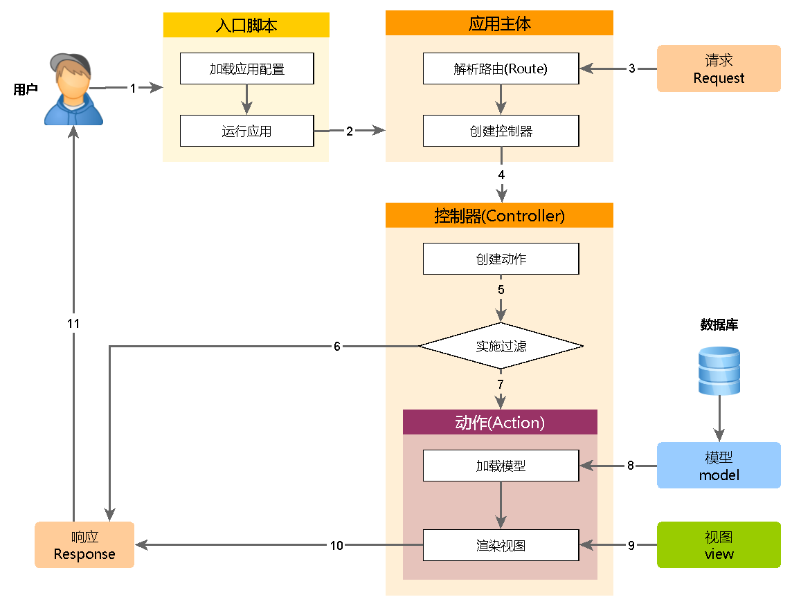

# The First Week

## MVC 模式

MVC模式（Model–view–controller）是软件工程中的一种软件架构模式，把软件系统分为三个基本部分：模型（Model）、视图（View）和控制器（Controller）


模型 Model 就是一个静态的数据模型，通过控制器 Controller 操作数据库等 

好处：利于分工
缺点：增加系统的复杂性

### Web MVC流程:



* Controller截获⽤用户发出的请求 
* Controller调⽤用Model`完成状态`的读写操作 
* Controller把数据传递给View 
* View渲染最终结果并呈献给⽤用户

控制器接收action，找到数据，然后生成 model，再把数据包给 view

## Yii

开发环境安装 [xampp](https://www.apachefriends.org/zh_cn/index.html)

Apache 服务器 通过localhost访问的是 htdocs 目录,
本地数据库管理 phpMyAdmin,
默认的mysql数据库 -> user表 -> host 用来控制本机ip的,
mysql -uroot -p123456 u是用户名 p是密码

检查网络防火墙 systemctl status firewalld
关闭防火墙 systemctl stop firewalld

### 压缩包下载 Yii

1. 通过压缩包下载 yii  basic，解压到 xampp 的 htdocs 目录下， 注意给 basic 权限 `chmod 777 basic/  -R ` 
2. 通过 localhost/xx 访问
3. 找到 basic 项目里面 config/web.php 文件， allowedIPs 是可以访问项目modules的 ip
4. CRUD Generator 增删改查
5. config/db.php 数据库配置

### Composer 下载 Yii

1. 通过 Composer 安装，这里可以参考[中文教程](https://www.yiichina.com/doc/guide/2.0/start-installation)
2. 安装完成，配置Web服务器或使用内置Web Server，需要注意的是 `php yii serve`要在项目根目录运行，教程的项目 web 目录有些坑。
3. 需要本地数据库，这里我们安装集成开发环境xampp，启动数据库，方便接下来数据库连接。

[php 内置的 web 服务器](https://secure.php.net/manual/zh/features.commandline.webserver.php)

有时候我们需要在同一局域网中的另一台设备中访问这个服务器（例如iPad或本地虚拟机），为此，我们可以把localhost换成0.0.0.0，让PHP Web服务器监听所有接口：

```php
php -S localhost:8080

php -S 0.0.0.0:8080

// 在yii项目根目录指定启动目录为web
php -S localhost:8000 -t web/
```
### 应用结构
```js
├── assets // 用于存放前端资源包，用于管理 CSS、JS 等前端资源
├── commands // 控制台应用的命令类，前端不需要这个
├── composer.json // 类似 package.json
├── config // 配置文件
├── controllers  // 控制层
├── mail // 应用的前后台和命令行的与邮件相关的布局文件等。
├── models //数据层
├── runtime // 运行时的临时文件目录（缓存文件和日志文件）
├── tests // 用于存放测试类。
├── vendor // 存放 Yii 的源码和通过 composer 安装的项目依赖库
├── views // 视图层
├── web // Web服务器可以访问的目录，域名指向的目录，包含入口文件，可存放css、js、img、font等静态资源
├── widgets // 用于存放一些常用的小挂件的类文件。
```


每个应用都有一个入口脚本 web/index.php，这是整个应用中唯一可以访问的 PHP 脚本。 入口脚本接受一个 Web 请求并创建应用实例去处理它。 应用在它的组件辅助下解析请求， 并分派请求至 MVC 元素。视图使用小部件 去创建复杂和动态的用户界面。



1. 用户向入口脚本 web/index.php 发起请求。
2. 入口脚本加载应用配置并创建一个应用 实例去处理请求。
3. 应用通过请求组件解析请求的 路由。
4. 应用创建一个控制器实例去处理请求。
5. 控制器创建一个动作实例并针对操作执行过滤器。
6. 如果任何一个过滤器返回失败，则动作取消。
7. 如果所有过滤器都通过，动作将被执行。
8. 动作会加载一个数据模型，或许是来自数据库。
9. 动作会渲染一个视图，把数据模型提供给它。
10. 渲染结果返回给响应组件。
11. 响应组件发送渲染结果给用户浏览器。