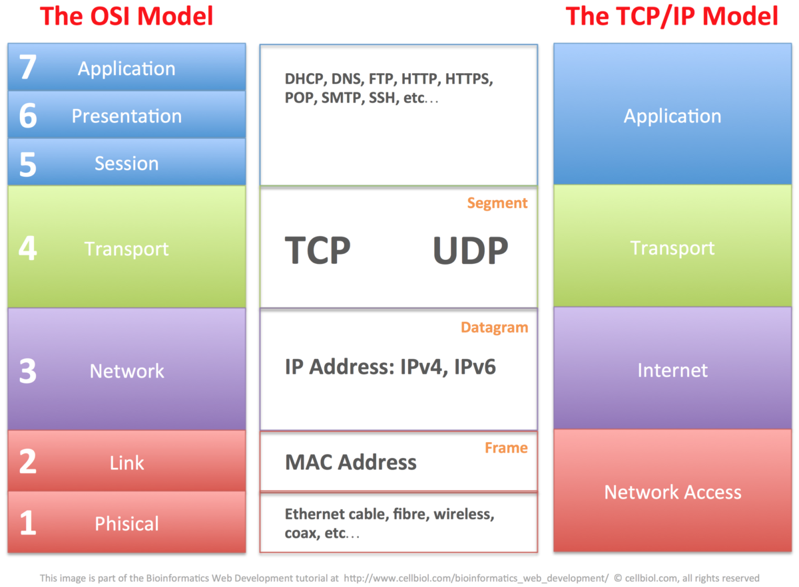
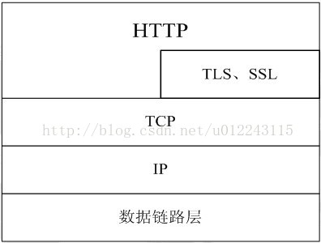
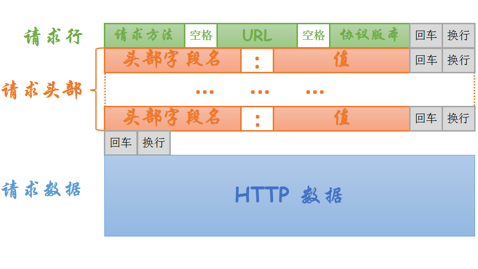
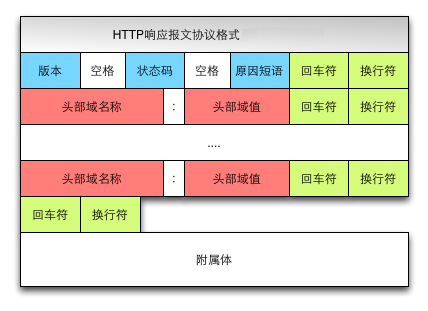
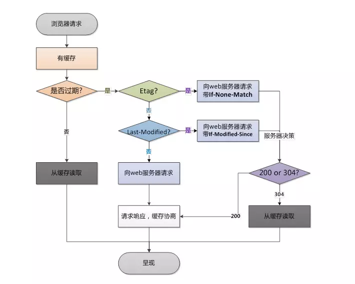
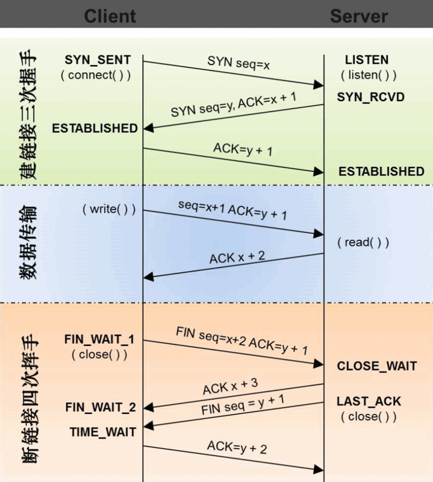

# http protocol

## 浏览器行为与 HTTP 协议

简单的处理流程：

1. 首先用户向浏览器发指令，例如 www.google.com
2. 然后浏览器首先要测试网络连通性，可能是路由器、网关、防火墙，接着 dns 解析，拿到 ip 地址
4. 浏览器发送 http 请求，底层是路由策略，中继站（路由器），去的时候的路和回来的路可能不一样
5. 请求到一个 ip 地址，可能是集群有多个服务器，找到提供服务的服务器
6. 服务器处理请求，返回 html 响应
7. 浏览器处理 html 页面
8. 继续请求其他资源

加速器把一些线路短路掉，绕过一些障碍

## 什么是 http 协议

HTTP（Hyper Text Transfer Protocol）是超文本传输协议，从 www 服务器传输到本地浏览器的一种传输协议，网站是基于 HTTP 协议的，例如网站的图片、CSS、JS 等都是基于 HTTP 协议进行传输的。

HTTP 协议是由从客户机到服务器的请求 (Request) 和从服务器到客户机 的响应 (response) 进行约束和规范。

#### 了解 TCP/IP 协议栈

TCP/IP 协议模型

1. 应用层：为用户提供所需要的各种服务，例如：HTTP、FTP、DNS、SMTP 等。
2. 传输层：为应用层实体提供端到端的通信功能，保证数据包的顺序传送及数据的完整性。
该层定义了两个主要的协议：传输控制协议 (TCP) 和用户数据报协 议 (UDP).
3. 网络层：主要解决主机到主机的通信问题。IP 协议是网际互联层最重要的协议。
4. 链路层：负责监视数据在主机和网络之间的交换

ISO 协议模型

1. 物理层：网线、无线电波 wifi、4G
2. 数据链路层：网卡
3. 网络层：解决从主机到主机最基础的通信问题 `ping www.google.com` 数据报协议
4. 传输层：TCP 可靠， UPD 不可靠，各有优点
5. 会话层：维持通信状态
6. 表示层：数据处理
7. 应用层：提供接口

一般不能跨层，ping 相当于工具

#### HTTP 在 TCP/IP 协议栈中的位置

HTTP 协议通常承载于 TCP 协议之上，有时也承载于 TLS 或 SSL 协议层之上，这个时候，就成了我们常说的 HTTPS。

#### http2 vs http1.1 https

* http 默认端口 80
* https 默认端口 443
* http2 默认端口 443

#### http 的工作过程

一次 HTTP 操作称为一个事务，其工作过程可分为四步，只要一步失败，http 请求失败

1. 首先客户机与服务器建立 TCP 连接
2. 建立连接后，客户机发送一个请求给服务器
3. 服务器接到请求后，给予相应的响应信息
4. 客户端接收服务器所返回的信息，然后客户机与服务器断开连接

如果在以上过程中的某一步出现错误，那么产生错误的信息将返回到客户端

#### 请求和响应

* HTTP 请求组成：请求行、消息报头、请求正文。 
* 请求行组成：以一个方法符号开头，后面跟着请求的 URI 和协议的版本。

* HTTP 响应组成：状态行、消息报头、响应正文。 
* 状态行组成：服务器 HTTP 协议的版本，服务器发回的响应状态代码和状 态代码的文本描述。

#### HTTP 首部字段

HTTP 首部字段根据实际通途被分为以下 4 种类型：

- 通用首部字段（General Header Fileds）：请求报文和响应报文两方都会使用的首部
- 请求首都字段（Request Header Fields）：从客服端向服务器端发送请求报文时使用的首部。
- 响应首部字段（Response Header Fields）：从服务器端向客户端返回响应报文时使用的首部。
- 实体首部字段（Entity Header Fields）：针对请求报文和响应报文的实体部分使用的首部。

常用请求报头

- Accept 请求报头域用于指定客户端接受哪些类型的信息
- Accept-Language 请求报头域类似于 Accept，但是它是用于指定一种自然语言。
- Authorization 请求报头域主要用于证明客户端有权查看某个资源
- Host 请求报头域主要用于指定被请求资源的 Internet 主机和端口号，它通常从 HTTP URL 中提取出来 的，发送请求时，该报头域是必需的。
- User-Agent 请求报头域允许客户端将它的操作系统、浏览器和其它属性告诉服务器。

常用响应报头

- Location 响应报头域用于重定向接受者到一个新的位置
- Server 响应报头域包含了服务器用来处理请求的软件信息

常用的实体报头

- Content-Encoding 实体报头域被用作媒体类型的修饰符
- Content-Language 实体报头域描述了资源所用的自然语言
- Content-Length 实体报头域用于指明实体正文的长度，以字节方式存储的十进制数字来表示
- Content-Type 实体报头域用语指明发送给接收者的实体正文的媒体类型
- Last-Modified 实体报头域用于指示资源的最后修改日期和时间
- Expires 实体报头域给出响应过期的日期和时间

#### 常用请求方法

- GET: 请求获取 Request-URI 所标识的资源
- POST: 在 Request-URI 所标识的资源后附加新的数据
- OPTIONS: 请求查询服务器的性能，或者查询与资源相关的选项和需求

#### HTTP 状态码

- 1xx: 指示信息--表示请求已接收，继续处理 
- 2xx: 成功--表示请求已被成功接收、理解、接受 
- 3xx: 重定向--要完成请求必须进行更进一步的操作 
- 4xx: 客户端错误--请求有语法错误或请求无法实现 
- 5xx: 服务器端错误--服务器未能实现合法的请求

#### cookies 与 session
- Cookies 是保存在客户端的小段文本
- Session 则保存在服务器端，通过唯一的值 sessionID 来区别每一个用户

#### cookie 的使用

- Cookie: 客户端将服务器设置的 Cookie 返回到服务器；
- Set-Cookie: 服务器向客户端设置 Cookie;

#### 缓存机制

浏览器缓存：节省网络资源和服务器资源。

在浏览器第一次发起请求时，本地无缓存，向 web 服务器发送请求，服务器起端响应请求，浏览器端缓存。

在第一次请求时，服务器会将页面最后修改时间通过 Last-Modified 标识由服务器发送给客户端，客户端记录修改时间；服务器还会生成一个 Etag，并发送给客户端。

浏览器后续再次进行请求时：

#### 强缓存（本地缓存）和协商缓存（弱缓存）

强缓存：普通刷新会忽略强缓存，需要强制刷新。只有在地址栏或收藏夹输入网址、通过链接引用资源等情况下，浏览器才会启用强缓存。

强缓存是利用 Expires 和 Cache-Control 两个字段来控制的，用来表示资源的缓存时间。

1. Expires 失效的时间是一个绝对时间，所以当服务器与客户端时间偏差较大时，就会导致缓存混乱
2. Cache-Control 是一个相对时间。

- no-cache：不使用本地缓存
- no-store：直接禁止游览器缓存数据
- public：可以被所有的用户缓存，包括终端用户和 CDN 等中间代理服务器
- private：只能被终端用户的浏览器缓存
- max-age: 响应的最大秒，比 Expires 优先级高

协商缓存：利用下面两种策略，由服务器来确定缓存资源是否可用，会优先验证 ETag

1. Etag/If-None-Match 策略
2. Last-Modified/If-Modified-Since 策略

- Etag：web 服务器响应请求时，告诉浏览器当前资源在服务器的唯一标识（生成规则由服务器决定）
- If-None-Match：当资源过期时（使用 Cache-Control 标识的 max-age)，发现资源具有 Etag 声明，则再次向 web 服务器请求时带上头 If-None-Match (Etag 的值）。web 服务器收到请求后发现有头 If-None-Match 则与被请求资源的相应校验串进行比对，决定返回 200 或 304。

- Last-Modified：资源最终修改的时间
- If-Modify-Since：用于确定代理或客户端拥有的本地资源的有效性

为什么有了 Last-Modified 还要 Etag ?

1. 文件的更改，但是内容并不改变（仅仅改变的修改时间），这个时候不希望重新 GET
2. Last-Modified 能检查到的颗粒是秒，一秒内修改的文件无法判断
3. 某些服务器不能精确的得到文件的最后修改时间

## HTTPS 协议分析

- 对称加密：可以逆运算
- 非对称加密：不可逆，例如公钥私钥，比对称加密性能差很多

HTTP 协议是明文的，存在以下风险

* 窃听风险（eavesdropping）：第三方可以获知通信内容。
* 篡改风险（tampering）：第三方可以修改通信内容。
* 冒充风险（pretending）：第三方可以冒充他人身份参与通信。

#### SSL/TLS

* 1996 年 SSL 3.0 版问世，得到大规模应用。
* 1999 年 互联网标准化组织标准化 SSL 之后的名称改为 TLS
* 2006 年 发布 TLS 1.1 和 1.2 版

SSL 采用非对称加密，客户端先向服务器端索要公钥，然后用公钥加密信息，服务器收到密文后，用自己的私钥解密。

在网络分层模型中，TCP 被称为“传输层协议”，而 HTTP 被称为“应用层协议”，HTTP 协议需要依靠 TCP 协议来传输数据

> HTTP/1.1 起，默认使用长连接 Connection:keep-alive，可以减少浪费，节约时间。

建立 TCP 连接需要三次握手四次挥手是需要资源消耗和时间消耗的

客户机首先发出一个 SYN 消息，服务器使用 SYN+ACK 应答表示接收到了这个消息，最后客户机再以 ACK 消息响应。

* SYN: 同步序列编号（Synchronize Sequence Numbers), TCP/IP 建立连接时使用的`握手信号`
* seq：序列编号 Sequence
* ACK: 确认字符 (Acknowledgement)
* SYN_RECV：指服务端被动打开后，接收到了客户端的 SYN 并且发送了 ACK 时的状态
* ESTABLISHED：TCP 的状态，指建立连接
* FIN: 表示关闭连接
* 2MSL: MSL 是 Maximum Segment Lifetime, 译为“报文最大生存时间”，他是任何报文在网络上存在的最长时间，超过这个时间报文将被丢弃。

#### 三次握手

1. 第一次握手：建立连接。客户端发送连接请求报文段，将 SYN 位置为 1，Sequence Number 为 x；然后，客户端进入 SYN_SEND 状态，等待服务器的确认；
2. 第二次握手：服务器收到 SYN 报文段。服务器收到客户端的 SYN 报文段，需要对这个 SYN 报文段进行确认，设置 Acknowledgment Number 为 x+1(Sequence Number+1)；同时，自己还要发送 SYN 请求信息，将 SYN 位置为 1，Sequence Number 为 y；服务器端将上述所有信息放到一个报文段（即 SYN+ACK 报文段）中，一并发送给客户端，此时服务器进入 SYN_RECV 状态；
3. 第三次握手：客户端收到服务器的 SYN+ACK 报文段。然后将 Acknowledgment Number 设置为 y+1，向服务器发送 ACK 报文段，这个报文段发送完毕以后，客户端和服务器端都进入 ESTABLISHED 状态，完成 TCP 三次握手。

#### 四次挥手

1. 第一次分手：主机 1（可以使客户端，也可以是服务器端），设置序列号 (Sequence Number) 和确认字符 (Acknowledgment Number)，向主机 2 发送一个 FIN 报文段；此时，主机 1 进入 FIN_WAIT_1 状态；这表示主机 1 没有数据要发送给主机 2 了；
2. 第二次分手：主机 2 收到了主机 1 发送的 FIN 报文段，向主机 1 回一个 ACK 报文段，Acknowledgment Number 为 Sequence Number 加 1；主机 1 进入 FIN_WAIT_2 状态；主机 2 告诉主机 1，我“同意”你的关闭请求；
3. 第三次分手：主机 2 向主机 1 发送 FIN 报文段，请求关闭连接，同时主机 2 进入 LAST_ACK 状态；
4. 第四次分手：主机 1 收到主机 2 发送的 FIN 报文段，向主机 2 发送 ACK 报文段，然后主机 1 进入 TIME_WAIT 状态；主机 2 收到主机 1 的 ACK 报文段以后，就关闭连接；此时，主机 1 等待 2MSL 后依然没有收到回复，则证明 Server 端已正常关闭，那好，主机 1 也可以关闭连接了。

#### [http 1.x 网络优化](https://hpbn.co/http1x/#using-multiple-tcp-connections)

- 减少DNS查找，每个主机名解析都需要网络往返，对请求施加延迟并在查找过程中阻止请求。
- 减少HTTP请求，最快的请求是未提出请求，消除页面上不必要的资源。
- 使用内容分发网络 CDN，在地理位置上将数据定位在更靠近客户端的位置可以显着减少每个TCP连接的网络延迟并提高吞吐量。
- 添加 Expires 标头并配置 ETag，应缓存相关资源，以避免在每个页面上重新请求相同的字节。
- Gzip压缩， 平均而言 Gzip将文件大小减小60-80％。
- 避免HTTP重定向，HTTP重定向可能非常昂贵，尤其是当它们将客户端重定向到不同的主机名时，这会导致额外的DNS查找，TCP连接延迟等。
- 域名分片，多域名加载资源，每个新的主机名都需要额外的DNS查找，每个额外的套接字消耗额外的资源，最糟糕的是，要求网站作者手动管理资源分配的位置和方式。

## [http 2](https://developers.google.com/web/fundamentals/performance/http2/?hl=zh-cn)

HTTP/2 将 HTTP 协议通信分解为二进制编码帧的交换，这些帧对应着特定数据流中的消息。所有这些都在一个 TCP 连接内复用。 这是 HTTP/2 协议所有其他功能和性能优化的基础。

* 使用二进制格式传输，更高效、更紧凑。
* 对报头压缩，降低开销。
* 多路复用，一个网络连接实现并行请求。
* 服务器主动推送，减少请求的延迟
* 默认使用加密

##### 二进制分帧层（核心）

传输期间的编码方式变了，HTTP/1.x 协议以换行符作为纯文本的分隔符，而 HTTP/2 将所有传输的信息分割为更小的消息和帧，并采用二进制格式对它们编码。

##### 数据流、消息和帧（基础）

HTTP/2 将 HTTP 协议通信分解为二进制编码帧的交换，这些帧对应着特定数据流中的消息。所有这些都在一个 TCP 连接内复用。

##### 请求与响应复用

在 HTTP/1.x 中，如果客户端要想发起多个并行请求以提升性能，则必须使用多个 TCP 连接，大多数现代浏览器（桌面和移动）每个主机最多可以打开六个连接。这种模型也会导致队首阻塞，从而造成底层 TCP 连接的效率低下。

HTTP/2 中新的二进制分帧层突破了这些限制，实现了完整的请求和响应复用：客户端和服务器可以将 HTTP 消息分解为互不依赖的帧，然后交错发送，最后再在另一端把它们重新组装起来。

HTTP/2 中的新二进制分帧层解决了 HTTP/1.x 中存在的队首阻塞问题，也消除了并行处理和发送请求及响应时对多个连接的依赖。 结果，应用速度更快、开发更简单、部署成本更低。

##### 数据流优先级

每个数据流都有一个关联的权重和依赖关系：

* 可以向每个数据流分配一个介于 1 至 256 之间的整数。
* 每个数据流与其他数据流之间可以存在显式依赖关系。

数据流依赖关系和权重的组合明确表达了资源优先级，这是一种用于提升浏览性能的关键功能。

HTTP/2 协议还允许客户端随时更新这些优先级，进一步优化了浏览器性能。 换句话说，我们可以根据用户互动和其他信号更改依赖关系和重新分配权重。资源受阻的时候不能保证特定的处理或传输顺序。

##### 每个来源一个连接
所有 HTTP/2 连接都是永久的，而且仅需要每个来源一个连接，随之带来诸多性能优势。
迁移到 HTTP/2 不仅可以减少网络延迟，还有助于提高通量和降低运行成本。

> 连接数量减少对提升 HTTPS 部署的性能来说是一项特别重要的功能：可以减少开销较大的 TLS 连接数、提升会话重用率，以及从整体上减少所需的客户端和服务器资源。

##### 服务器推送

HTTP/2 打破了严格的请求-响应语义，支持一对多和服务器发起的推送工作流，在浏览器内外开启了全新的互动可能性。

服务器可以对一个客户端请求发送多个响应：

* 由客户端缓存
* 在不同页面之间重用
* 与其他资源一起复用
* 由服务器设定优先级
* 被客户端拒绝

##### 报头压缩

在 HTTP/2 中，请求和响应报头字段的定义保持不变

差异：所有报头字段名称均为小写，请求行现在拆分成几个伪报头字段。

* :method 目标URL模式部分(请求) 
* :scheme 目标URL模式部分(请求)
* :authority 目标RUL认证部分(请求)
* :path 目标URL的路径和查询部分(绝对路径 产生式和一个跟着"?"字符的查询产生式)。 (请求)
* :status 响应头中的HTTP状态码部分(响应)