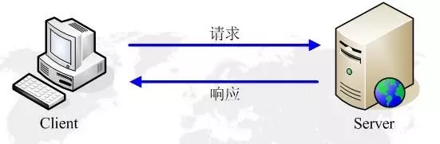

# http protocol

## 浏览器行为与 HTTP 协议

简单的处理流程：

1. 首先用户向浏览器发指令，例如 www.google.com
2. 然后浏览器首先要测试网络连通性，可能是路由器、网关、防火墙，接着 dns 解析，拿到 ip 地址
4. 浏览器发送 http 请求，底层是路由策略，中继站（路由器），去的时候的路和回来的路可能不一样
5. 请求到一个 ip 地址，可能是集群有多个服务器，找到提供服务的服务器
6. 服务器处理请求，返回 html 响应
7. 浏览器处理 html 页面
8. 继续请求其他资源

加速器把一些线路短路掉，绕过一些障碍

## 什么 http 协议

HTTP（Hyper Text Transfer Protocol）是超文本传输协议，从 www 服务器传输到本地浏览器的一种传输协议，网站是基于 HTTP 协议的，例如网站的图片、CSS、JS 等都是基于 HTTP 协议进行传输的。

HTTP 协议是由从客户机到服务器的请求 (Request) 和从服务器到客户机 的响应 (response) 进行约束和规范。

#### 了解 TCP/IP 协议栈

TCP/IP 协议模型

1. 应用层：为用户提供所需要的各种服务，例如：HTTP、FTP、DNS、SMTP 等。
2. 传输层：为应用层实体提供端到端的通信功能，保证数据包的顺序传送及数据的完整性。
该层定义了两个主要的协议：传输控制协议 (TCP) 和用户数据报协 议 (UDP).
3. 网络层：主要解决主机到主机的通信问题。IP 协议是网际互联层最重要的协 议。
4. 网络接口层：负责监视数据在主机和网络之间的交换

ISO 协议模型

1. 物理层：网线、无线电波 wifi、4G
2. 数据链路层：网卡
3. 网络层：解决从主机到主机最基础的通信问题 `ping www.google.com` 数据报协议
4. 传输层：TCP 可靠， UPD 不可靠，各有优点
5. 会话层：维持通信状态
6. 表示层：数据处理
7. 应用层：提供接口

一般不能跨层，ping 相当于工具

#### HTTP 在 TCP/IP 协议栈中的位置

HTTP协议通常承载于TCP协议之上，有时也承载于TLS或SSL协议层之上，这个时候，就成了我们常说的HTTPS。

#### http2 vs http1.1 https

* http 默认端口 80
* https 默认端口 443
* http2 默认端口 443

#### http 的工作过程

一次 HTTP 操作称为一个事务，其工作过程可分为四步，只要一步失败，http 请求失败

1. 首先客户机与服务器建立 TCP 连接
2. 建立连接后，客户机发送一个请求给服务器
3. 服务器接到请求后，给予相应的响应信息
4. 客户端接收服务器所返回的信息，然后客户机与服务器断开连接

如果在以上过程中的某一步出现错误，那么产生错误的信息将返回到客户端

#### 请求和响应

* HTTP 请求组成：请求行、消息报头、请求正文。 
* HTTP 响应组成：状态行、消息报头、响应正文。 
* 请求行组成：以一个方法符号开头，后面跟着请求的 URI 和协议的版本。
* 状态行组成：服务器 HTTP 协议的版本，服务器发回的响应状态代码和状 态代码的文本描述。

#### HTTP 首部字段

HTTP 首部字段根据实际通途被分为以下 4 种类型：

- 通用首部字段（General Header Fileds）：请求报文和响应报文两方都会使用的首部
- 请求首都字段（Request Header Fields）：从客服端向服务器端发送请求报文时使用的首部。
- 响应首部字段（Response Header Fields）：从服务器端向客户端返回响应报文时使用的首部。
- 实体首部字段（Entity Header Fields）：针对请求报文和响应报文的实体部分使用的首部。

常用请求报头

- Accept 请求报头域用于指定客户端接受哪些类型的信息
- Accept-Language 请求报头域类似于 Accept，但是它是用于指定一种自然语言。
- Authorization 请求报头域主要用于证明客户端有权查看某个资源
- Host 请求报头域主要用于指定被请求资源的 Internet 主机和端口号，它通常从 HTTP URL 中提取出来 的，发送请求时，该报头域是必需的。
- User-Agent 请求报头域允许客户端将它的操作系统、浏览器和其它属性告诉服务器。

常用响应报头

- Location 响应报头域用于重定向接受者到一个新的位置
- Server 响应报头域包含了服务器用来处理请求的软件信息

常用的实体报头

- Content-Encoding 实体报头域被用作媒体类型的修饰符
- Content-Language 实体报头域描述了资源所用的自然语言
- Content-Length 实体报头域用于指明实体正文的长度，以字节方式存储的十进制数字来表示
- Content-Type 实体报头域用语指明发送给接收者的实体正文的媒体类型
- Last-Modified 实体报头域用于指示资源的最后修改日期和时间
- Expires 实体报头域给出响应过期的日期和时间

#### 常用请求方法

- GET: 请求获取 Request-URI 所标识的资源
- POST: 在 Request-URI 所标识的资源后附加新的数据
- OPTIONS: 请求查询服务器的性能，或者查询与资源相关的选项和需求

#### HTTP 状态码

- 1xx: 指示信息--表示请求已接收，继续处理 
- 2xx: 成功--表示请求已被成功接收、理解、接受 
- 3xx: 重定向--要完成请求必须进行更进一步的操作 
- 4xx: 客户端错误--请求有语法错误或请求无法实现 
- 5xx: 服务器端错误--服务器未能实现合法的请求

#### cookies 与 session
- Cookies 是保存在客户端的小段文本
- Session 则保存在服务器端，通过唯一的值 sessionID 来区别每一个用户

#### cookie 的使用

- Cookie: 客户端将服务器设置的 Cookie 返回到服务器；
- Set-Cookie: 服务器向客户端设置 Cookie;

#### 缓存机制

浏览器缓存：节省网络资源和服务器资源。

在浏览器第一次发起请求时，本地无缓存，向 web 服务器发送请求，服务器起端响应请求，浏览器端缓存。

在第一次请求时，服务器会将页面最后修改时间通过 Last-Modified 标识由服务器发送给客户端，客户端记录修改时间；服务器还会生成一个 Etag，并发送给客户端。

浏览器后续再次进行请求时：

#### 强缓存（本地缓存）和协商缓存（弱缓存）

强缓存：普通刷新会忽略强缓存，需要强制刷新。只有在地址栏或收藏夹输入网址、通过链接引用资源等情况下，浏览器才会启用强缓存。

强缓存是利用 Expires 和 Cache-Control 两个字段来控制的，用来表示资源的缓存时间。

1. Expires 失效的时间是一个绝对时间，所以当服务器与客户端时间偏差较大时，就会导致缓存混乱
2. Cache-Control 是一个相对时间。

- no-cache：不使用本地缓存
- no-store：直接禁止游览器缓存数据
- public：可以被所有的用户缓存，包括终端用户和 CDN 等中间代理服务器
- private：只能被终端用户的浏览器缓存
- max-age: 响应的最大秒，比 Expires 优先级高

协商缓存：利用下面两种策略，由服务器来确定缓存资源是否可用，会优先验证 ETag

1. Etag/If-None-Match 策略
2. Last-Modified/If-Modified-Since 策略

- Etag：web 服务器响应请求时，告诉浏览器当前资源在服务器的唯一标识（生成规则由服务器决定）
- If-None-Match：当资源过期时（使用 Cache-Control 标识的 max-age)，发现资源具有 Etag 声明，则再次向 web 服务器请求时带上头 If-None-Match (Etag 的值）。web 服务器收到请求后发现有头 If-None-Match 则与被请求资源的相应校验串进行比对，决定返回 200 或 304。

- Last-Modified：资源最终修改的时间
- If-Modify-Since：用于确定代理或客户端拥有的本地资源的有效性

为什么有了 Last-Modified 还要 Etag ?

1. 文件的更改，但是内容并不改变（仅仅改变的修改时间），这个时候不希望重新 GET
2. Last-Modified 能检查到的颗粒是秒，一秒内修改的文件无法判断
3. 某些服务器不能精确的得到文件的最后修改时间

## HTTPS 协议分析

- 对称加密：可以逆运算
- 不对称加密：不可逆，例如公钥私钥