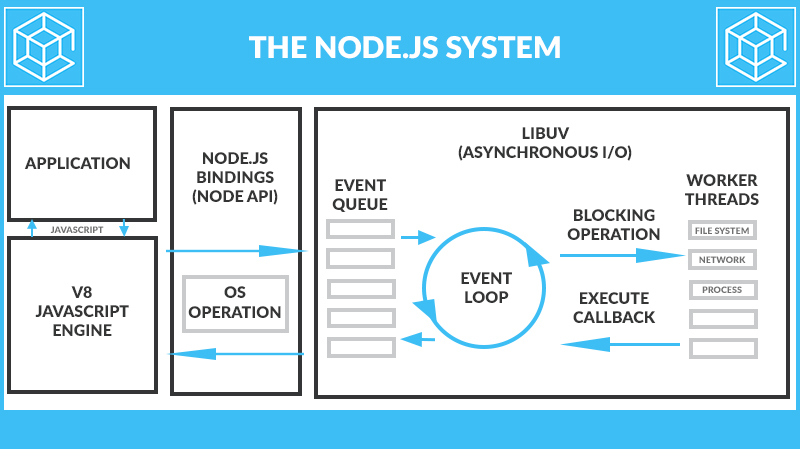
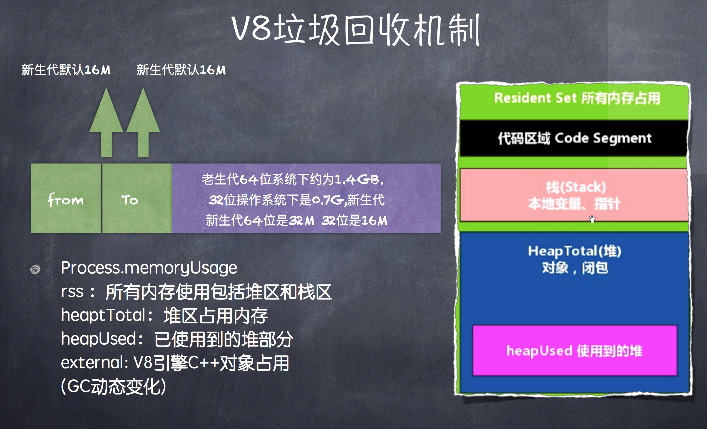

## 大规模 NodeJS 项目架构和优化

- SPA(csr)
- node+spa
- MPA(ssr)
- 同构化，前后端共用一套模版，例如 vue

1. 为性能指标做直出
2. 削减 API
3. 让 FE 同学控制整个项目，做前后的分离

##### 异步 IO 的好处

- 前端通过异步 IO 可以消除 UI 阻塞
- I/O 是昂贵的，分布式 I/O 是更昂贵的。 
- NodeJS 适用于 IO 密集型不适用 CPU 密集型

LIBUV 管理 event loop



```js
setTimeout(function () { 
    console.log(1);
}, 0); 
setImmediate(function () {
    console.log(2); 
});
process.nextTick(() => {
    console.log(3); 
});
new Promise((resovle,reject)=>{ 
    console.log(4);
    resovle(4);
}).then(function(){
    console.log(5); 
});
console.log(6);

// 4 6 3 5 1 2
```

##### 函数式编程在 Node 中的应用

高阶函数：可以将函数作为输入或者返回值

偏函数：指定部分参数产生一个新的定制函数的形式就是偏函数。

#####  常用的 Node 控制异步技术手段

Async、Await

Promise/Defferred 是一种先执行异步调用，延迟传递的处理方式

##### V8 垃圾回收机制


 
默认情况下，Node 使用 JavaScript 在服务端操作大内存对象受到了一定的限制（堆区），64 位系统下约为 1.4GB，栈区 32 位操作系统下是 0.7G。
新生代 64 位是 32M， 32 位是 16M。

- --max-old-space-size 设置老生代内存空间
- --max-new-space-size 设置新生代内存空间

V8 的垃圾回收策略主要基于分代式垃圾回收机制，V8 中内存分为新生代和老生代两代。新生代为存活时间较短对象， 老生代中为存活时间较长的对象。

##### Scavenge（清除）算法


Scavenge 算法是典型的牺牲空间换取时间的算法，在分代的基础上，新生代中的对象主要通过 Scavenge 算法进行垃圾回收。在 Scavenge 算法的具体实现中，主要采用 Cheney 算法。

Cheney 算法是一种采用复制的方式实现的垃圾回收算法。它将内 存一分为二，每一个空间称为 semispace（半空间）。

这两个 semispace 中一个处于使用，一个处于闲置。处于使用的称之为 From, 闲置的称之为 To。分配对象时先分配到 From, 当开始进行垃圾回收时，检查 From 存活对象赋值到 To。

先将对象先分配到 From, 当开始进行垃圾回收时，检查 From 有用的对象赋值到 To，没用的被释放。然后互换位置。

互换位置 5 次晋升到老生代，或者发现 To 空间已经使用了超过 25%晋升到老生代，设置 25%这个限制值的原因是当次 Scavenge 回收完成后，这个 To 空间将变成 From 空间，接下来的内存分配将在这个空间进行。如果占比过高会影响后来的内存分配。

#####  Mark-Sweep & Mark-Compact


Mark-Sweep 是标记清除，标记那些死亡的对象，然后清除。但是清除过后出现内存不连续的情况，所以我们要使用 Mark-Compact。

他是基于 Mark-Sweep 演变而来的，他先将活着的对象移到一边，移动完成后，直接清理边界外的内存。当 CPU 空间不足的时候会非常的高效。V8 后续还引入了延迟处理，增量处理，并计划引入并行标记处理。

##### 常见内存泄漏问题

1. 无限制增长的数组（eg. 变量当缓存）
2. 无限制设置属性和值
3. 任何模块内的私有变量和方法均是永驻内存的 （变量赋值为 null 不会立马 GC, 而是下一次 GC 回收）
4. 大循环，无 GC 机会（递归，循环的时候不敢GC）

内存泄漏分析工具 node-inspector 

#### PM2

pm2 是一个带有负载均衡功能的Node应用的进程管理器. 当你要把你的独立代码利用全部的服务器上的所有CPU，并保证进程永远都活着， 0秒的重载。
 
1. 内建负载均衡(使用Node cluster 集群模块)
2. 后台运行
3. 0秒停机重载
4. 具有Ubuntu和CentOS 的启动脚本
5. 停止不稳定的进程(避免无限循环)
6. 控制台检测
7. 提供 HTTP API
8. 远程控制和实时的接口API ( Nodejs 模块,允许和PM2进程管理器交互 )
