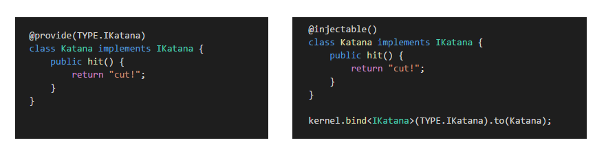

## ioc

基于 SOILD 设计原则，介绍一个 IOC（控制容器反转）的库 InversifyJS 和相关工具库

[InversifyJS](https://github.com/inversify/InversifyJS)

[inversify-koa-utils](https://github.com/diego-d5000/inversify-koa-utils)

[inversify-binding-decorators](https://github.com/inversify/inversify-binding-decorators)

### InversifyJS

首先 InversifyJS 需要 TypeScript >= 2.0，配置对应的 tsconfig.json 文件

InversifyJS 需要一个现代 JavaScript 引擎，支持：

- [Reflect metadata](https://rbuckton.github.io/reflect-metadata/)
- [Map](https://developer.mozilla.org/en-US/docs/Web/JavaScript/Reference/Global_Objects/Map)
- [Promise](https://developer.mozilla.org/en-US/docs/Web/JavaScript/Reference/Global_Objects/Promise) (Only required if using [provider injection](https://github.com/inversify/InversifyJS/blob/master/wiki/provider_injection.md))
- [Proxy](https://developer.mozilla.org/en-US/docs/Web/JavaScript/Reference/Global_Objects/Proxy) (Only required if using [activation handlers](https://github.com/inversify/InversifyJS/blob/master/wiki/activation_handler.md))

假如有一种不支持，就需要导入对应的 polyfill，然而就目前而言，node还不支持 reflect-metadata，所以安装对应 polyfill 。

```js
npm install inversify reflect-metadata --save
```


#### 控制依赖项的范围

InversifyJS 默认使用瞬态范围（inTransientScope），但您也可以使用单例（inSingletonScope）和请求范围（inRequestScope）

#### 实现接口和标识符的类型

依赖于抽象，而不是具体结果（实例），也就是说类（class）的实现依赖于接口（interface）

InversifyJS 在运行时需要使用 identifiers，是为了给**容器的提供和 inject 提供唯一标识**，主要为以下三种类型：

1. symbols
2. classes
3. string

```ts
export interface Warrior { // 接口名 Warrior，需要实现两个方法
    fight(): string;
    sneak(): string;
}

export const TYPES = {
    Warrior: Symbol.for("Warrior") // 声明 Symbol 类型作为标识符
};
```

#### 使用`@injectable`＆`@inject`decorators 声明依赖项

1. 构造函数注入

```ts
@injectable() // 使用装饰器进行修饰，表示可以注入到容器中，用于接下来可以通过标识符将 Ninja 绑定到容器
class Ninja implements Warrior {

    private _katana: Weapon;
    private _shuriken: ThrowableWeapon;

    public constructor(
	    @inject(TYPES.Weapon) katana: Weapon, // 将 TYPES.Weapon 对应的实例当构造参数传入
    ) {
        this._katana = katana;
    }

    public fight() { return this._katana.hit(); }

}
```

2. 属性注入

```ts
@injectable() // 使用装饰器进行修饰，表示可以注入到容器中，后面还需要绑定到容器
class Ninja implements Warrior {
    @inject(TYPES.Weapon) private _katana: Weapon; // 将 TYPES.Weapon 对应的实例当属性传入
    public fight() { return this._katana.hit(); }
}
```

#### 创建和配置Container

容器是唯一存在耦合的地方

```ts
import { Container } from "inversify";
import { TYPES } from "./types";
import { Warrior } from "./interfaces";
import { Ninja} from "./entities";

const myContainer = new Container(); // 创建容器
myContainer.bind<Warrior>(TYPES.Warrior).to(Ninja); // 声明绑定，将 Ninja 类绑定到标识符TYPES.Warrior上

export { myContainer };
```

#### 解析依赖关系

可以使用 Container 类中的 `get<T>` 方法来解析依赖。

```ts
import { myContainer } from "./inversify.config"; 
import { TYPES } from "./types";
import { Warrior } from "./interfaces";

const ninja = myContainer.get<Warrior>(TYPES.Warrior); 
// InversifyJS 容器将尝试使用构造函数或动态值工厂生成对象实例或值，如果是单例，就缓存该值。
// 从容器中拿到 TYPES.Warrior 对应的实例类

expect(ninja.fight()).eql("cut!"); // true
expect(ninja.sneak()).eql("hit!"); // true
```

### inversify-koa-utils

这个库就是把 inversify 和  koa 做了一个融合，提供了一些工具。

```
npm install inversify-koa-utils --save
```

####  装饰控制器

如果想将 class 用作 koa 的 controller，只需给类添加 @controller 装饰器。

```ts
import * as Koa from 'koa';
import { interfaces, Controller, Get, Post, Delete } from 'inversify-koa-utils';
import { injectable, inject } from 'inversify';

@controller('/foo') // 声明一个响应 /foo 的控制器
@injectable() // 表示可以注入到容器
export class FooController implements interfaces.Controller {

    constructor( @inject('FooService') private fooService: FooService ) {}
    // 通过构造注入标识符'FooService'到 FooController 中

    @httpGet('/') // 修饰类的方法，注意下面的 Router，源码里是 koa-router
    private index(ctx: Router.IRouterContext , next: () => Promise<any>): string {
        return this.fooService.get(ctx.query.id);
    }
  
}
```

#### 配置容器和服务器

1. 按照 inversify 文档配置容器。

2. 创建服务，将容器传递给 InversifyKoaServer 构造函数。
3. 为了让 InversifyKoaServer 能找到你写的 controllers，必须将它们绑定到 TYPE.Controller 标识符。使用 controller's name 绑定到 TYPE.Controller 上。

```ts
import { Container } from 'inversify';
import { interfaces, InversifyKoaServer, TYPE } from 'inversify-koa-utils';

// 创建容器
let container = new Container();

// 必须绑定你的controllers 到 TYPE.Controller 上，这个 TYPE 是 inversify-koa-utils 提供的。
// 当目标名称是 'FooController'，绑定 FooController 类到 TYPE.Controller 标识符上。
container.bind<interfaces.Controller>(TYPE.Controller).to(FooController).whenTargetNamed('FooController');
container.bind<FooService>('FooService').to(FooService);

// 创建服务
let server = new InversifyKoaServer(container);
server.setConfig((app) => {
  // koa应用程序的对象，方便加载 middleware
}).setErrorConfig((app) => {
  // 一些容错
});

let app = server.build();// 将所有已注册的控制器和中间件附加到koa应用程序, 并返回应用程序实例。
app.listen(3000);
```

#### 可以配置自定义路由

```ts
import * as Router from 'koa-router';

let container = new Container();

let router = new Router({
    prefix: '/api',
});

let server = new InversifyKoaServer(container, router);
```

默认情况下，在根路径` / `提供服务，可以配置路由前缀，如下所有路由都应以`/api/v1`开头。

```ts
let container = new Container();

let server = new InversifyKoaServer(container, null, { rootPath: "/api/v1" });
```

#### 可以将自定义 Koa 实例

```ts
let container = new Container();

let app = new Koa();

let server = new InversifyKoaServer(container, null, null, app);
```


### inversify-binding-decorators

```js
npm install inversify-binding-decorators --save
```

####  多次绑定怎么约束 AMBIGUOUS_MATCH 错误的？(防止后面定义的别名看不懂)

- [Tagged bindings](https://github.com/inversify/InversifyJS/blob/master/wiki/tagged_bindings.md)
- [Named bindings](https://github.com/inversify/InversifyJS/blob/master/wiki/named_bindings.md)

```ts
// Tagged bindings
@inject("Weapon") @tagged("canThrow", false) katana: Weapon,
@inject("Weapon") @tagged("canThrow", true) shuriken: Weapon

container.bind<Weapon>(weaponId).to(Katana).whenTargetTagged("canThrow", false);
container.bind<Weapon>(weaponId).to(Shuriken).whenTargetTagged("canThrow", true);
```

```ts
// Named bindings
@inject("Weapon") @named("strong") katana: Weapon,
@inject("Weapon") @named("weak") shuriken: Weapon

container.bind<Weapon>("Weapon").to(Katana).whenTargetNamed("strong");
container.bind<Weapon>("Weapon").to(Shuriken).whenTargetNamed("weak");
```

使用 inversify-binding-decorators 之前，绑定类到容器。

```ts
import { injectable, Container } from "inversify";
import "reflect-metadata";

@injectable()
class Katana implements Weapon {
    public hit() {
        return "cut!";
    }
}

@injectable()
class Shuriken implements ThrowableWeapon {
    public throw() {
        return "hit!";
    }
}

var container = new Container();
container.bind<Katana>("Katana").to(Katana);// 将 Katana 类绑定到 string 标识符"Katana"上
container.bind<Shuriken>("Shuriken").to(Shuriken);
```



#### 装饰器 @provide

使用 inversify-binding-decorators 后，绑定类到容器。

```ts
import { injectable, Container } from "inversify";
import { provide, buildProviderModule } from "inversify-binding-decorators";
import "reflect-metadata";

@provide(Katana)
class Katana implements Weapon {
    public hit() {
        return "cut!";
    }
}

@provide(Shuriken)
class Shuriken implements ThrowableWeapon {
    public throw() {
        return "hit!";
    }
}

var container = new Container();

// 使用装饰器 `@provide` 修饰类的时候，可以 Reflects 当前 package 提供的所有装饰器，并将它们打包到一个模块buildProviderModule中，最后由容器container加载。
container.load(buildProviderModule());
```

#### 多次使用 @provide

如果多次使用 @provide（也就是将一个类绑定到多个标识符上），该库将抛出异常。

如果您尝试声明多个绑定，请使用 @provide(ID, true)，可以通过将 force 参数传递给 @provide 来克服这个问题。

```ts
@provide(Ninja, true)// classes 作为标识符，force 参数为 true，强行绑定
@provide("Ninja", true) //string
@provide(Symbol("Ninja"), true) // symbols
class Ninja {
    // ...
}
```

#### 第二个装饰器 @fluentProvide

@provide 装饰器不允许您声明上下文约束，范围和其他高级绑定功能，@fluentProvide 可以实现。

```ts
// 好处之一是可以创建别名
let provideThrowable = function(identifier, isThrowable) {
	return fluentProvide(identifier)
		      .whenTargetTagged("throwable", isThrowable) // 标记绑定
		      .done();
};

@provideThrowable(TYPE.Weapon, true)
class Katana implements Weapon {
    public hit() {
        return "cut!";
    }
}

// 另一个例子
let provideSingleton = function(identifier) {
	return fluentProvide(identifier)
		      .inSingletonScope()
		      .done();
};

@provideSingleton(TYPE.Weapon)
class Shuriken implements Weapon {
    public hit() {
        return "hit!";
    }
}
```

#### 多次使用 @fluentProvide

如果多次使用 @fluentProvide（也就是将一个类绑定到多个标识符上），该库将抛出异常。

如果你想要声明多个绑定，请使用 done ( true )，可以通过将 force 参数传递给 done() 来克服这个问题。

```ts
const provideSingleton = (identifier: any) => {
    return fluentProvide(identifier)
    .inSingletonScope()
    .done(true); // IMPORTANT! 强制绑定
};

function shouldThrow() {
    @provideSingleton("Ninja")
    @provideSingleton("SilentNinja")
    class Ninja {}
    return Ninja;
}
let container = new Container();
container.load(buildProviderModule());
```

#### 自动提供应用实例

用于将 default @provide 装饰器添加到模块的所有公共属性：

```ts
import * as entites from "../entities";

let container = new Container();
autoProvide(container, entites);
let warrior = container.get(entites.Warrior);
expect(warrior.fight()).eql("Using Katana...");
```