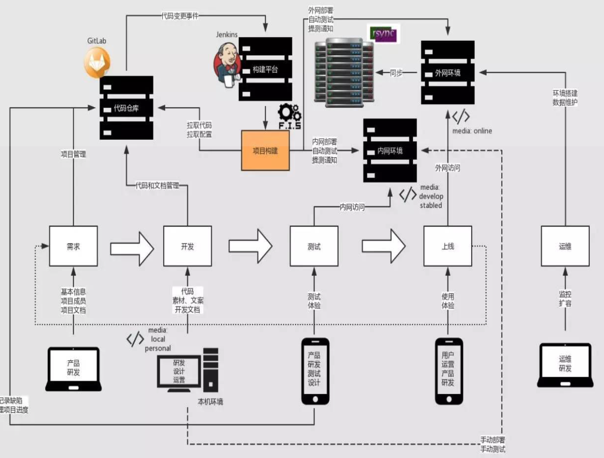

## 前端架构构建

### 持续集成 (Continuous integration)

在持续集成环境中，开发人员将会频繁的提交代码到 feature 分支。这些新提交在最终合并到 master 分支之前，都需要通过编译和自动化测试流进行验证。 这样保障所有的提交在合并 master 之后的质量问题，对可能出现的一些问题进行预警。

### 持续交付 (CONTINUOUS DELIVERY)

除了自动化测试，我们还需要有自动化的发布流，以及通过一个按键部署上线。

### 持续部署 (CONTINUOUS DEPLOYMENT)

通过持续部署，任何修改，只要通过了所有已有的工作流就会直接和用户见面。没有人为干预（没有一键部署按钮），只有当一个修改在工作流中构建失败才能阻止它部署到产品线。

#### 前端工程化

- 自动化编译。
- 前端模块化。
- 定位静态资源。
- 前端开发组件化。
- 自动化部署测试配合版本库。
- 自动化性能优化

##### 简单自动化编译流程

1. es6+ 进行编译
2. 对 less、scss、stylus 进行编译
3. 文件、图片压缩
4. 加 md5 戳

##### 前端模块化

CMD 和 AMD 都是 CommonJS 的一种规范的实现定义，RequireJS 和 SeaJS 是对应的实践。

CMD 依赖是就近声明。通过内部 require 方法进行声明。但是因为是异步模块，加载器需要提前加载这些模块，所以模块真正使用前需要提取模块里面所有的依赖。

AMD 依赖是提前声明。这种优势的好处就是依赖无需通过静态分析，无论是加载器还是自动化工具都可以很直接的获取到依赖。

##### 定位静态资源

增量更新，方便回滚，可以只修改两个文件不一样的地方

##### web components

1. Custom Elements `<ls-britz></ls-britz>`
2. HTML Imports `import britz from 'xx.vue'`
3. HTML Templates `<template></template>`
4. Shadow DOM 外界的 css 对 Shadow DOM 没有任何影响 `#shadow-root`

##### 自动化部署

- Travis CI
- Jenkins

##### 更多自动化 (More Automation）

1. 自动化运营平台 
2. 自动化雪碧图 
3. 自动化离线打包 
4. 自动化控制缓存级别 
5. 自动化处理 Inline 
6. 自动化根据网速分发版本资源 
7. 自动化运维平台