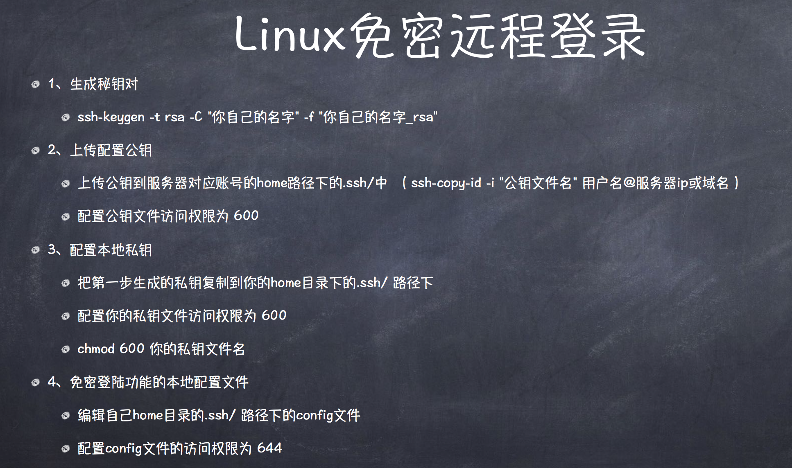

## linux 预备知识

#### 重要的 linux 命令

服务管理命令 systemctl

网络管理命令 ifconfig、ip 命令 router

命令行下载命令 curl wget

#### 常用 linux 终端快捷键

- ctrl+c 结束正在运行的程序 ping、telnet 等
- ctrl+d 结束输入或退出 shell
- ctrl+s 暂停屏幕输入
- ctrl+q 恢复屏幕输入
- ctrl+l 清屏
- ctrl+a 快速回到行首 ahead
- ctrl+e 快速回到行尾 end

#### 进程、线程与协程

任一时刻，CPU 总是运行一个进程，其他进程处于非运行状态，4 核 cpu 可以分配 4 个进程。

**进程**：`内核态`由操作系统内核进行资源分配（cpu 时间、内存）和调度的一个独立单位。每个进程都有自己的独立内存空间，不同进程通过进程间通信来通信。由于进程比较重量，占据独立的内存，所以上下文进程间的切换开销（栈、寄存器、虚拟内存、文件句柄等）比较大，但相对比较稳定安全。

**线程**：由 CPU 调度和分派的最小单位，线程只拥有在运行中必不可少的资源（一组寄存器和栈），但是它可与同属一个进程的其他的线程共享进程所拥有的全部资源。线程间通信主要通过共享内存，上下文切换很快，资源开销较少，但相比进程不够稳定容易丢失数据。

**协程**：是一种`用户态`的轻量级线程，协程的调度完全由用户控制。协程拥有自己的寄存器上下文和栈。协程调度切换时，将寄存器上下文和栈保存到其他地方，在切回来的时候，恢复先前保存的寄存器上下文和栈，直接操作栈则基本没有内核切换的开销，可以不加锁的访问全局变量，所以上下文的切换非常快。

IO 密集型：输入输出，网卡、硬盘、数据库 io 操作是最慢的

输入是给 cpu, 输出是 cpu 处理完成，网络操作（路由器）频繁的进出，就是 IO 密集型操作

IO 密集型应用发展：多进程 -> 多线程 -> 事件驱动（node 里的 libuv）-> 协程（大吞吐量）

CPU 密集型应用发展：多进程 -> 多线程 (eg. 科学数据运算）

调度和切换的时间：多进程 -> 多线程 -> 协程 （操作系统管理进程和线程的切换频率太高，CPU 资源就被消耗在切换上了）

操作系统的设计，因此可以归结为三点：

（1）以多进程形式，允许多个任务同时运行；

（2）以多线程形式，允许单个任务分成不同的部分运行；

（3）提供协调机制，一方面防止进程之间和线程之间产生冲突，另一方面允许进程之间和线程之间共享资源。（死锁、信号量）

#### 进程管理相关命令

- top 命令 （类似资源管理器）
- ps 命令 （Process Status  进程状态）
- kill pkill 命令 
  + kill 是向操作系统内核发送一个信号，linux 有 32 种信号，"9" 信号是强制关闭一个进程
  + kill 跟进程编号，pkill 跟进程名称
- w 命令（who 看看谁登录了）
- ss 命令、netstat 命令、lsof 命令 找到端口占用的进程

#### linux 免密登录

1. 生成密钥对，不对称加密
    - -t 指定要创建的密钥类型
    - -C 提供一个新注释
    - -f 指定密钥文件名
2. 上传配置公钥 chmod（Change mode 改变模式）
    - ssh-copy-id 将本地主机的公钥复制到远程主机的 `~/.ssh/authorized_keys` 文件上，并且设置合适的权限。
    - `~`普通用户在`／home/用户名`，root 用户在 `／root`
3. 配置本地私钥
4. 免密登录功能的本地配置文件
   1. 配置客户端 config 文件，ssh 登录以免密登录的形式登录，会先读 config 文件
   2. 假如没有配置 config 或者配置不了，指定私钥，`ssh -i 私钥文件路径+文件名 root@140.82.21.152`



#### 本地客户端 `~/.ssh/config` 文件配置

```bash
# 多主机配置
Host gateway-produce
HostName IP 或绑定的域名
Port 22
Host node-produce
HostName IP 或绑定的域名
Port 22
Host java-produce
HostName IP 或绑定的域名
Port 22

Host *-produce
User root
IdentityFile ~/.ssh/produce_key_rsa
Protocol 2
Compression yes
ServerAliveInterval 60
ServerAliveCountMax 20
LogLevel INFO

#单主机配置
Host britz-server
User root
HostName IP 或绑定的域名
IdentityFile ~/.ssh/britz_rsa
Protocol 2
Compression yes
ServerAliveInterval 60
ServerAliveCountMax 20
LogLevel INFO

```
