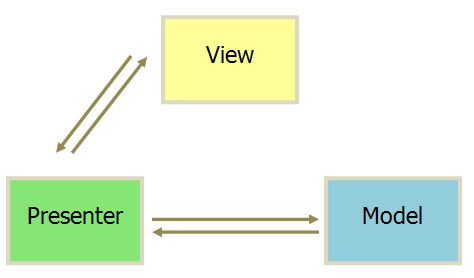
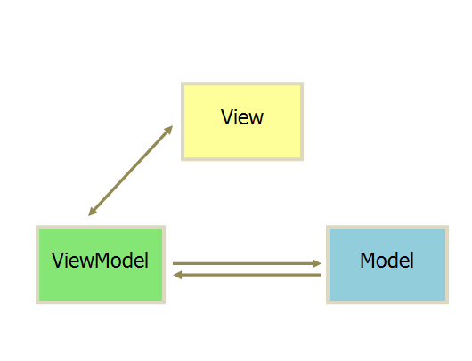

## [MVC & MVP & MVVM](http://www.ruanyifeng.com/blog/2015/02/mvcmvp_mvvm.html)

MVC 是单向通信。

1. 用户可以向 View 发送指令（DOM 事件），再由 View 直接要求 Model 改变状态。
2. 用户也可以直接向 Controller 发送指令（改变 URL 触发 hashChange 事件），再由 Controller 发送给 View。
3. Controller 非常薄，只起到路由的作用，而 View 非常厚，业务逻辑都部署在 View。所以，Backbone 索性取消了 Controller，只保留一个 Router（路由器） 。

MVP 各部分之间的通信，都是双向的。

1. View 与 Model 不发生联系，都通过 Presenter 传递。
2. View 非常薄，不部署任何业务逻辑，称为"被动视图"（Passive View），即没有任何主动性，而 Presenter 非常厚，所有逻辑都部署在那里。

MVVM 基本和 MVP 一样

唯一的区别是，它采用双向绑定（data-binding）：View 的变动，自动反映在 ViewModel