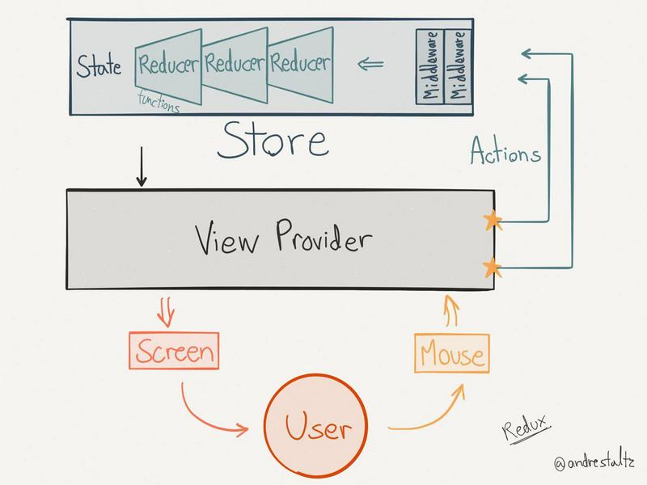

## react

react 本身只涉及 UI 层（为了 DOM 性能，动态感知 state 的变化），虚拟 dom, 最小化 DOM 更新，批量操作 DOM。单向数据流。

react 一切都是组件，能够更灵活的组合，可重用性，可维护性，可测试性。

- jsx
- props
- state
- lifecycle

#### Flux

flux 是一共架构思想，专门解决软件的结构问题，跟 mvc 架构是同一类东西，但是更加简单和清晰。

- view：视图层
- action（动作）：视图层发出的消息（比如 mouseClick)
- dispatcher（派发器）：用来接收 action、执行回调函数
- store（数据层）：用来存放应用的状态，一旦发生变化，就提醒 view 更新页面

1. 用户访问 view
2. view 发出用户的 action
3. dispatcher 收到 action，要求 store 进行相应的更新
4. store 更新之后，发出一个“change”事件
5. view 收到“change”事件之后，更新页面

#### [redux](https://github.com/YutHelloWorld/Blog/issues/3)

state 不可变性，按引用传递（对象），改变对象一个属性，整个对象也会重新渲染。immutable 是处理同步事件和异步事件的走两变 state 问题的。

provider 是连接 view 和 redux store 的容器

redux 接收旧的的 state 和一个 action, 组成一个新的 state

redux 是为了管理 store，store 转到 react 组件里叫 state。
有了 redux 的组件里就不应该有 state，组件没有 state 又想渲染组件用 props。props 又是 redux 给的。

1. mapStateToProps：redux 把所有的 state 转换成 props
2. mapDispatcherToProps：redux 把 action 里的 dispatch 转换为 props

#### GraphQL && Relay/Falcor

端对点

relay 是构建数据驱动 react 应用的 javascript 框架。
- 声明式：结构
- 托管：结构放到 view 里面
- 转变：提供自动数据一致性，优化更新和错误处理

高阶组件`返回`一个新组件
异步数据要写表达式 async，有管理异步数据的组件
context 传递扁平化
ref新使用

fiber dom

同步return
异步dispatch 
reducer要纯