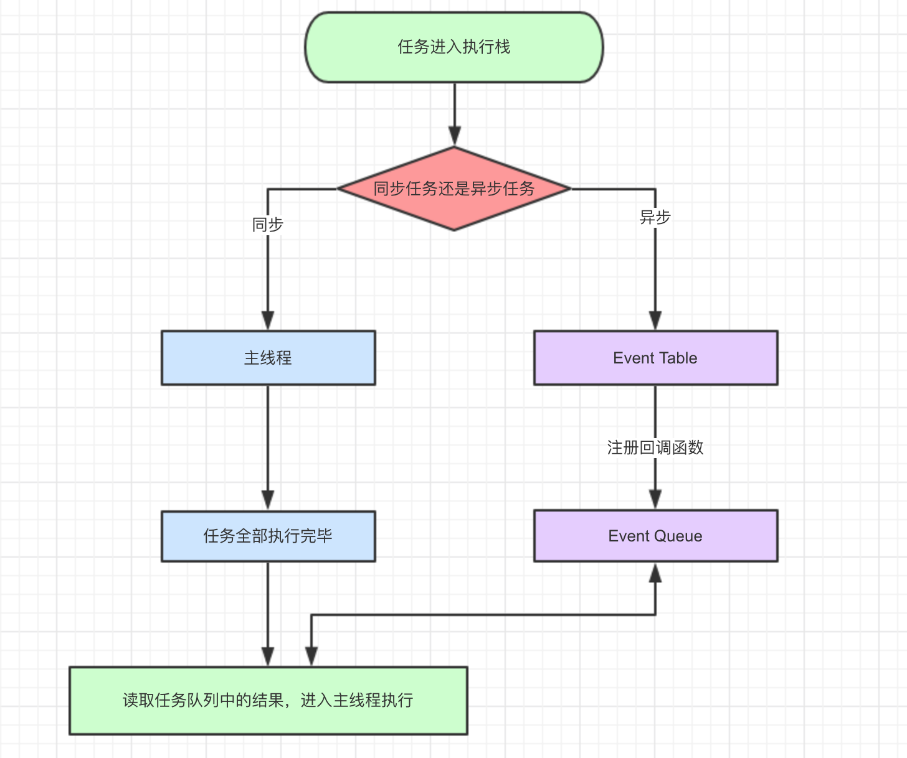
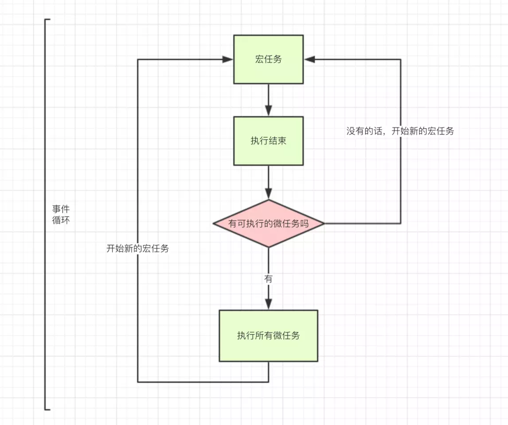

#### JavaScript 运行机制

JavaScript 是一个单线程的语言。（Web-Worker的多线程都是用单线程模拟出来的）

单线程就意味着，同一时间不能处理多个任务，所有任务需要排队执行。
有些任务执行过程中，有时候 CPU 处于闲置状态，这个时候主线程可以先挂载等待中的任务，执行后面的任务。

- 同步任务（进入主线程）
- 异步任务（进入 Event Table && 注册回调函数）
    - 宏任务 macro-task
    - 微任务 micro-task

#### 事件循环 (Event Loop)

只要主线程空了，就会去读取"任务队列"，不断重复这个过程。

JavaScript 引擎存在 monitoring process 进程，持续不断的检查主线程执行栈是否为空。

（1）所有**同步任务都在主线程**上执行，形成一个执行栈（execution context stack）。

（2）只要**异步任务有了运行结果**，就在"任务队列（task queue）"之中放置一个事件(回调函数)。

（3）同步执行栈任务执行完毕，JavaScript 引擎就会读取"任务队列"，看看里面有哪些事件(回调函数)。那些回调函数对应的异步任务，结束等待状态，进入同步执行栈，开始执行。

（4）主线程不断重复上面的第三步。

#### 任务队列 (消息队列)
1. 同步任务（执行栈中的代码）
   - 在`主线程`上排队执行的任务，只有前一个任务执行完毕，才能执行后一个任务；
   - 主线程运行的时候，产生堆（heap）和栈（stack），栈中的代码调用各种外部API，它们在"任务队列"中加入各种事件（click，load，done）。只要栈中的代码执行完毕，主线程就会去读取"任务队列"，依次执行那些事件所对应的回调函数。
2. 异步任务 （任务队列）
    不进入主线程、而进入`"任务队列"`（task queue）的任务，只有"任务队列"通知主线程，某个异步任务可以执行了，该任务才会进入主线程执行。
    "任务队列"是一个先进先出的数据结构。

#### 宏任务 && 微任务

| 宏任务                | 浏览器支持 | Node支持 |
| :-------------------- | ---------- | -------- |
| I/O                   | ✅          | ✅        |
| setTimeout            | ✅          | ✅        |
| setInterval           | ✅          | ✅        |
| setImmediate          | ❌          | ✅        |
| requestAnimationFrame | ✅          | ❌        |
| 整体的 script 代码    | ✅          | ✅        |

| 微任务                              | 浏览器支持 | Node支持 |
| ----------------------------------- | ---------- | -------- |
| process.nextTick                    | ❌          | ✅        |
| MutationObserver                    | ✅          | ❌        |
| Promise的三个方法then,catch,finally | ✅          | ✅        |
| async/await                         | ✅          | ✅        |

1. 整体 script 作为第一个宏任务，script 执行过程中。
   1. 有同步任务立即执行同步任务。
   2. 遇到宏任务，添加到宏任务 Event Queue。
   3. 遇到微任务，添加微任务 Event Queue。
2. 当整体 script 执行结束，再去执行 Event Queue 里的微任务。当微任务也执行结束，那么一轮 Event Loop 结束。
3. 接着不断从宏任务到微任务。

#### 事件和回调函数
所谓"回调函数"（callback），就是那些会被主线程挂起来的注册事件。异步任务必须指定回调函数，当主线程开始执行异步任务，就是执行对应的回调函数。

setTimeout(fn,0) 的含义是：

1. 进入 Event Table && 注册回调函数 fn && 计时⌛️
2. 计时时间完成才进入Event Queue
3. 同步执行栈结束，才执行 Event Queue