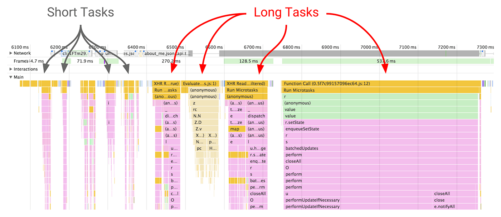

## chorme performance developer tool

DOM GC (DOM垃圾回收)
Evaluate Script (评估脚本)
Event (事件)
Major GC (清理老生带 Tenured space)
Minor GC (清理新生代)
Run Microtasks (运行微任务)
Timer Fired (销毁计时器)
XHR load (异步加载对象)

Event Log 事件日志

## 使用 RAIL 模型评估性能

以用户为中心；最终目标不是让您的网站在任何特定设备上都能运行很快，而是使用户满意。

* response： 立即响应用户，在 100 毫秒以内确认用户输入。

* animation：设置动画或滚动时，在 10 毫秒以内生成帧。滚动和触摸拖动也是动画类型，因为浏览器需要花费时间将新帧绘制到屏幕上，只有 10 毫秒来执行一帧代码。每一帧都要完成以下步骤：

* idie：最大程度增加主线程的空闲时间，利用空闲时间完成推迟的工作。要实现小于 100 毫秒的响应，应用必须在每 50 毫秒内将控制返回给主线程，这样应用就可以执行其像素管道、对用户输入作出反应，等等。

* load：持续吸引用户，在 1000 毫秒以内呈现交互内容。

## [以用户为中心的性能指标](https://developers.google.com/web/fundamentals/performance/user-centric-performance-metrics?hl=zh-cn#_2)

性能不仅仅是时间加载问题

- FP 首次绘制 First Paint
- FCP 首次内容绘制 First Contentful Paint
- FMP 首次有效绘制和主要元素计时 First Meanungful Paint
- Long Tasks 耗时较长的任务
- TTI 可交互时间 Time to Interactive

Long Tasks API 可以将任何耗时超过 50 毫秒的任务标示为可能存在问题，并向应用开发者显示这些任务。选择 50 毫秒的时间是为了让应用满足在 100 毫秒内响应用户输入的 RAIL 指导原则。

可交互时间 (TTI) 指标用于标记应用已进行视觉渲染并能可靠响应用户输入的时间点，应用可能会因为多种原因而无法响应用户输入：

- 页面组件运行所需的 JavaScript 尚未加载。
- 耗时较长的任务阻塞主线程。

TTI 指标可识别页面初始 JavaScript 已加载且主线程处于空闲状态（没有耗时较长的任务）的时间点。